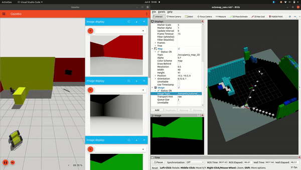
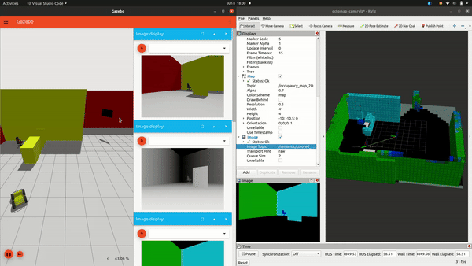

### Requirements
1. Ubuntu 20.04 and ROS Noetic
2. Gazebo Fortress

### Build the workspace
```
cd catkin_ws/src
git clone --recursive git@github.com:ExistentialRobotics/SSMI-example.git
catkin clean
catkin build
```

### Run the rosnodes
Please source the workspace before running the nodes
1. Terminal 1: launch the simulation node
```
roslaunch semantic_segmentation_husky seg_husky.launch
```

2. Terminal 2: launch the semantic octomap node
```
roslaunch semantic_octomap semantic_octomap.launch
```

3. Terminal 3: launch planner
```
roslaunch semantic_info_gathering run_semantic_exploration.launch
```

4. Terminal 4: launch the controller
```
roslaunch semantic_segmentation_husky jackal_pd.launch
```
### TF
1. World frame: /world
2. Robot body frame: /base_link
3. Camera Optical frame: /camera_optic


 <div style="display: flex; justify-content: center;">
  
  
</div>


